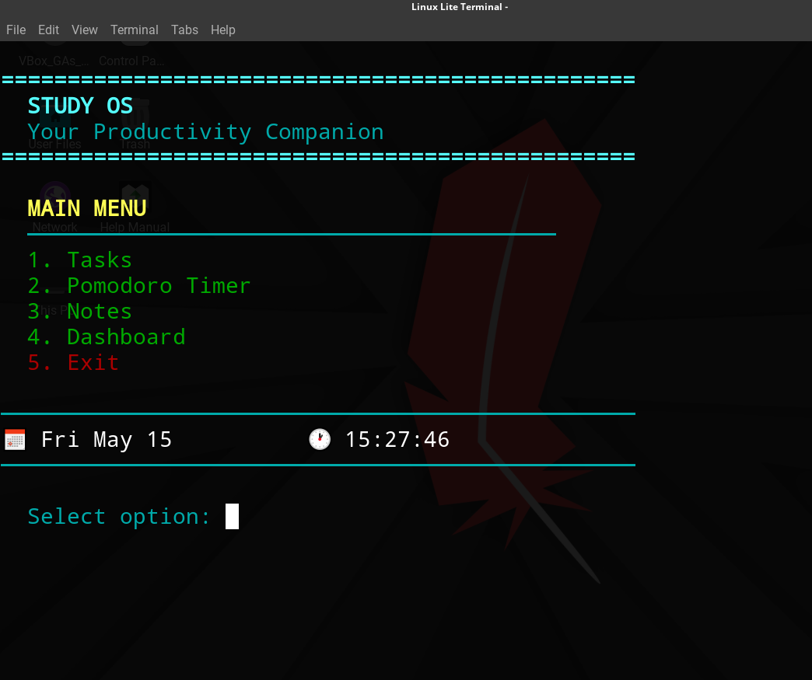
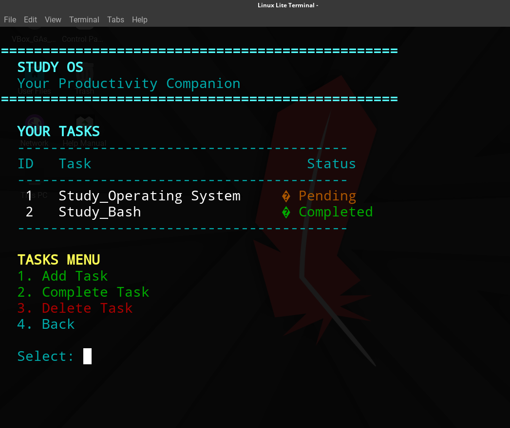
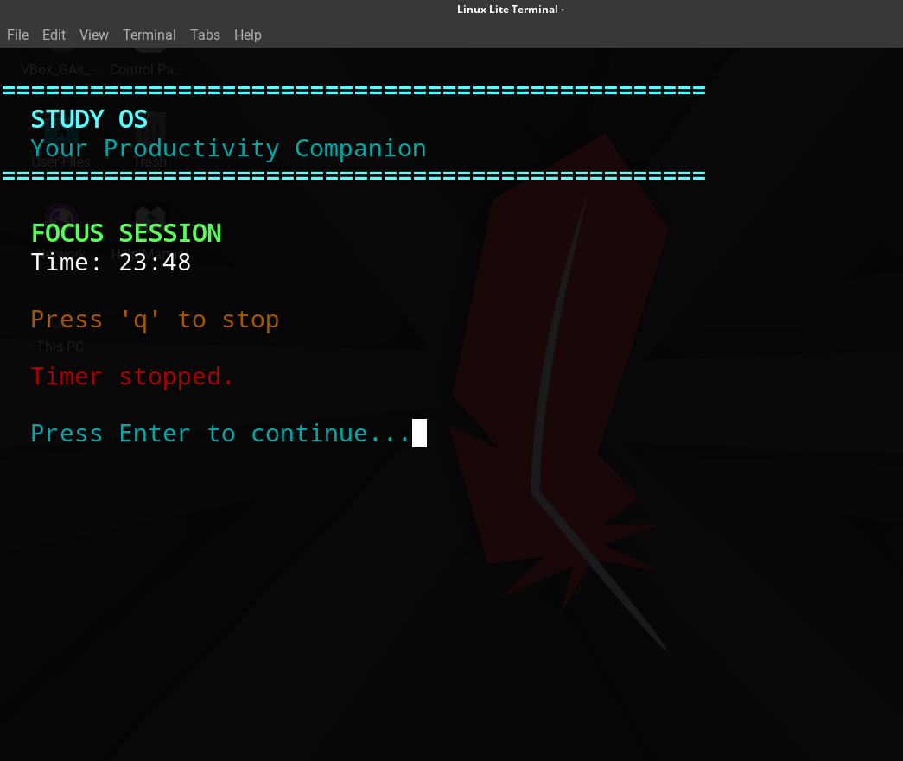
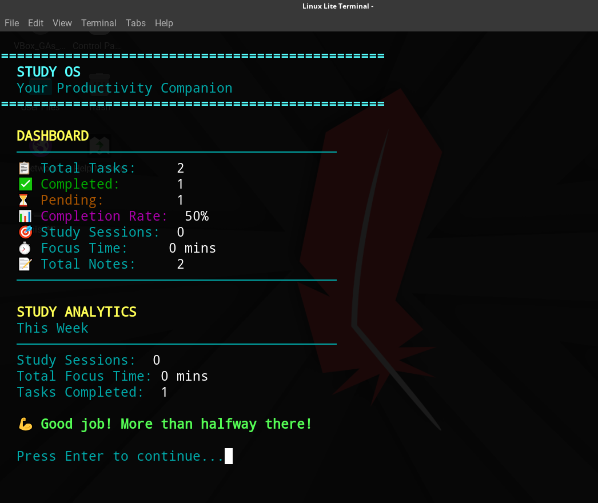

# 📚 StudyOS - Your Productivity Companion

A terminal-based productivity tool to manage tasks, track study time using Pomodoro technique, and take notes.

## ✨ Features

- 📋 *Task Management* - Add, complete, delete tasks with status tracking
- ⏱️ *Pomodoro Timer* - 25-minute focus timer with stop option (press 'q')
- 📝 *Notes Taking* - Add and delete study notes
- 📊 *Dashboard* - View analytics: completion rate, study sessions, focus time
- 💾 *Data Persistence* - Auto-save to files, load on startup
- 🎨 *Colored UI* - Clean, readable terminal interface

## 🚀 Installation

```bash
git clone https://github.com/atifasimsule245-coder/studyos
cd studyos
make
./studyos


## 📸 Screenshots






🎯 Usage


1. Tasks     - Manage your to-do list
2. Pomodoro Timer - Start 25-min focus session (press 'q' to stop)
3. Notes     - Save study notes
4. Dashboard - View your progress
5. Exit      - Save and quit


🛠️ Commands

bash
make        # Compile
make run    # Compile and run
make clean  # Remove compiled files
make install # Install to system


📁 File Structure

studyos/
├── main.cpp      # Source code
├── Makefile      # Build automation
├── README.md     # Documentation
├── tasks.txt     # Auto-generated
├── notes.txt     # Auto-generated
└── stats.txt     # Auto-generated
```

📄 License

MIT License - Free for everyone

🤝 Contributing

Pull requests welcome! For major changes, please open an issue first.

📧 Contact

Muhammad Atif - www.linkedin.com/in/muhammad-atif-73494a2b2
